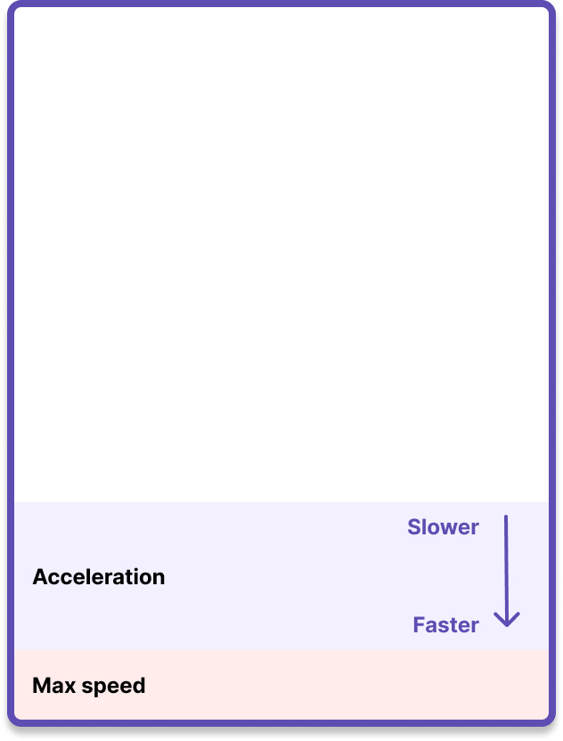

import SectionMessage from '@atlaskit/section-message';
import OverElementExample from '../../examples/over-element';
import LazyLoadedExample from '../../examples/lazy-loaded';
import AxisLocking from '../../examples/axis-locking';

This package works with any configuration of scrollable entities, and you can change the
configuration of your scrollable entities in any way you like during a drag.

<SectionMessage>

This package depends on [the core package](/components/pragmatic-drag-and-drop/core-package).

This package has no dependency on any view library (eg `react`), or on the Atlassian Design System.

</SectionMessage>

<Example Component={OverElementExample} appearance="showcase-only" />

## Registering auto scrolling for scrollable elements

Elements that are _registered_ for auto scrolling will be scrolled as a user drags close to the
edges of the element.

```ts
// each adapter type has its own auto scroller
import { autoScrollForElements } from '@atlaskit/pragmatic-drag-and-drop-auto-scroll/element';
import { autoScrollForExternal } from '@atlaskit/pragmatic-drag-and-drop-auto-scroll/external';
import { autoScrollForTextSelection } from '@atlaskit/pragmatic-drag-and-drop-auto-scroll/text-selection';

// enable better auto scrolling
const cleanup = autoScrollForElements({
	element: myScrollableElement,
});

// disable better auto scrolling
cleanup();
```

A slightly fuller example of a `react` list that is a _drop target_, and has auto scrolling

```tsx
import { useRef, ReactElement } from 'react';
import { dropTargetForElements } from '@atlaskit/pragmatic-drag-and-drop/element/adapter';
import { autoScrollForElements } from '@atlaskit/pragmatic-drag-and-drop-auto-scroll/element';
import { combine } from '@atlaskit/pragmatic-drag-and-drop/combine';
import invariant from 'tiny-invariant';

function ScrollableList({ children }: { children: ReactElement }) {
	const ref = useRef<HTMLDivElement | null>(null);

	useEffect(() => {
		const element = ref.current;
		invariant(element, 'Element ref not set');

		return combine(
			dropTargetForElements({
				element,
			}),
			// A scrollable element does not need to be a drop target,
			// but in this case it is.
			// We can add auto scrolling to an element along side our other
			// Pragmatic drag and drop bindings
			autoScrollForElements({
				element,
			}),
		);
	});

	return (
		<div ref={ref} style={{ overflowY: 'scroll' }}>
			{children}
		</div>
	);
}
```

### Element scrolling rules and behaviour

- You can position and style your scrollable elements however you like.
- Your scroll containers can have as many levels of nesting as you like.
- You have to register an element (eg with `autoScrollForElements`) to enable auto scrolling
  (otherwise the default auto scrolling will apply).
- A _registered_ scrollable element does not need to be drop target.
- Auto scrolling is registered for particular entity types. For example, `autoScrollForElements` is
  a drop target for elements, and `autoScrollForExternal` is for native drags.
- During a drag operation, you can:
  - Register new scrollable elements
  - Unregister scrollable elements
  - Change the styling, layout or dimensions of any scrollable element

## `autoScrollFor*` arguments

- `element`: the `HTMLElement` you want to add auto scrolling too. The `element` does not need to be
  a drop target. The `element` is the unique key for an auto scrolling registration.
- _(optional)_: `canScroll: (args: ElementGetFeedbackArgs) => boolean`: whether or not auto
  scrolling should occur. Disabling auto scrolling with `canScroll` will _not_ prevent the browsers
  built in auto scrolling, or manual user scrolling during a drag. Unfortunately, there is no way to
  opt out of the platforms built in auto scrolling. We included `canScroll` because it is helpful to
  disable this package's auto scrolling, as it is much easier for users to trigger than the
  platforms built in auto scrolling.

`canScroll` is a helpful way to only enable auto scrolling for particular entity types.

```ts
autoScrollForElements({
  element: myElement,
  // only enable auto scrolling when a Card is being dragged
  canScroll: ({ source }) => source.data.type === 'card',
}),
```

```ts
export type ElementGetFeedbackArgs = {
	/**
	 * The users _current_ input
	 */
	input: Input;
	/**
	 * The data associated with the entity being dragged
	 */
	source: DragType['payload'];
	/**
	 * The element trying to be scrolled
	 */
	element: Element;
};
```

- _(optional)_: `getAllowedAxis: (args: ElementGetFeedbackArgs) => AllowedAxis`: used to enable auto
  scrolling only on a particular axis. [See Axis locking guide](#axis-locking).

- _(optional)_: `getConfiguration: (args: ElementGetFeedbackArgs) => PublicConfig`: used to control
  some aspects of auto scrolling

```ts
autoScrollForElements({
  element: myElement,
  getConfiguration: () => ({
    maxScrollSpeed: 'fast',
  })
}),
```

We are intentionally only exposing a limited amount of configuration in order to promote
consistency. Right now we only expose a single simple configuration option:

- `maxScrollSpeed`: `'fast' | 'standard'`. We recommend using the default `"standard"` max scroll
  speed for most experiences. However, on _some_ larger experiences, a faster max scroll speed
  `"fast"` _can_ feel better.

## Registering auto scrolling for the `window`

```ts
import { autoScrollWindowForElements } from '@atlaskit/pragmatic-drag-and-drop-auto-scroll/element';
import { autoScrollWindowForExternal } from '@atlaskit/pragmatic-drag-and-drop-auto-scroll/external';
import { autoScrollWindowForInternalUncontrolled } from '@atlaskit/pragmatic-drag-and-drop-auto-scroll/internal-uncontrolled';

// enable better auto scrolling on the window during drag operations
const cleanup = autoScrollWindowForElements();

// disable better auto scrolling on the window
cleanup();
```

A slightly fuller example of a `react` board that has window auto scrolling

```tsx
import { useRef, ReactElement } from 'react';
import { autoScrollForElements } from '@atlaskit/pragmatic-drag-and-drop-auto-scroll/element';
import invariant from 'tiny-invariant';

function Board({ children }: { children: ReactElement }) {
	useEffect(() => {
		return autoScrollWindowForElements();
	});

	return <div className="board">{children}</div>;
}
```

### Window auto scrolling rules and behaviour

- You have to register window auto scrolling (eg with `autoScrollWindowForElements`) to enable auto
  scrolling (otherwise the default auto scrolling will apply).
- Auto scrolling is registered for particular entity types. For example,
  `autoScrollWindowForElements` will do auto scrolling when an element is being dragged, and
  `autoScrollWindowForExternal` will do auto scrolling when something from outside the `window` is
  being dragged over the `window`
- You can have multiple registrations for `window` auto scrolling, but only one registration will be
  needed for `window` auto scrolling to occur.
- If there are no active registrations for `window` auto scrolling, then no `window` auto scrolling
  will occur (except for the built in one).
- During a drag operation:
  - You can register or unregister window auto scrolling
  - You can change the content of the `document` so that the `window` grows or shrinks

## `autoScrollWindowFor*` arguments

- _(optional)_: `canScroll: (args: WindowGetFeedbackArgs) => boolean`: whether or not auto scrolling
  should occur. Disabling auto scrolling with `canScroll` will _not_ prevent the browsers built in
  auto scrolling, or manual user scrolling during a drag. Unfortunately, there is no way to opt out
  of the platforms built in auto scrolling. We included `canScroll` because it is helpful to disable
  this packages auto scrolling, as it is much easier for users to trigger than the platforms built
  in auto scrolling.

`canScroll` is a helpful way to only enable auto scrolling for particular entity types.

```tsx
autoScrollWindowForElements({
  // only enable auto scrolling when a Card is being dragged
  canScroll: ({ source }) => source.data.type === 'card',
}),
```

```ts
export type ElementGetFeedbackArgs = {
	/**
	 * The users _current_ input
	 */
	input: Input;
	/**
	 * The data associated with the entity being dragged
	 */
	source: DragType['payload'];
};
```

## Scroll speed dampening

We slow down the scroll speed based on two factors: time over an element, and closeness to an edge.

### Time dampening

The longer a user drags over a scrollable entity, the faster the scroll speed will be (up to a
limit).

Time dampening helps a user to avoid loosing context by scrolling too quickly when:

- Lifting a draggable element inside of a scrollable element
- Dragging into a scrollable element

Time dampening is reset when you leave an element, so if you re-renter an element again, time
dampening starts again.

Our time dampening value has been tuned to balance:

1. Trying to avoid losing context
2. Letting the user get stuff done quickly

Time dampening is shared between "over element" and "overflow" auto scroll regions.

Time dampening is reset when:

- A scrollable entity is unregistered for more than one frame
- A scrollable entity is no longer being dragged over (except for the `window` - see below)
- A drag operation is finished

The `window` time dampening timer does not reset if leaving the `window`. Currently no
`onDragLeaveWindow` and `onDragEnterWindow` events are published by Pragmatic drag and drop. If we
did publish those events, then we _could_ reset the auto scrolling acceleration timer for the
`window` when entering the `window`.

### Distance dampening

The closer a user's pointer is to the edge of a scrollable entity (element or window), the faster
the scroll will be. Distance dampening allows a user to control the scroll speed by moving closer /
further away from a scrollable edge

The max speed can be reached a distance away from the actual edge of a scrollable element. This is
so that users don't have to move right onto the edge to get the max speed - they can get the max
speed from a small distance out from the edge



## Dynamic scroll speed

In order to facilitate a great experience for all users, on all devices, we dynamically adjust the
speed of scroll changes based on the devices frame rate (measured in frames per second - `fps`)

**Devices running at `60fps`**

We can scroll up to our maximum target scroll change in a frame

**Devices running at higher frame rates (eg `120fps` displays)**

We lower the max scroll change per frame to ensure we don’t scroll too fast.

If we made the same scroll change per frame on a `120fps` device as we did on a 60fps device, then
the `120fps` device would be scrolling twice as fast

The auto scroller ensures that a `120fps` display scrolls at the same visible speed as a 60fps
devices.

**Devices running at slower than `60fps`**

You might think we would do the inverse of what we do for the `120fps` devices - increase the max
change per frame so that the overall speed would match a `60fps` device. However, this can lead to
large scroll changes in a single frame causing the experience to feel janky.

For lower frame rate devices, we cap the max scroll change per frame to match would it would be if
the device was running at `60fps`. This can result in a slower over all scroll speed, but the scroll
will always feel smooth.

**Dynamic switching**

These rules are applied on a _per frame_ basis. One device might move between all three categories
in the same drag operation.

## Scroll bubbling

In order to match the browser as closely as possible, as well as to provide an experience that feels
great, we have landed on the following algorithm for scrolling:

- Only scroll scrollable entities that the user is currently dragging over with their pointer.
- We scroll the inner most scrollable entity first, and then work upwards. This is known as _bubble
  ordering_ and it is the same order that Pragmatic drag and drop events flow.
- Only scroll one scrollable entity per axis (vertical / horizontal) in a frame. In order for a
  scrollable entity to be scrolled on an axis, it needs to have some available scroll in the
  applicable direction (forwards / backwards).

### Bubbling examples

For these examples, we have two elements that are both scrollable: `child` and `parent`

```html
<div id="parent">
	<div id="child">
		<!-- content -->
	</div>
</div>
```

**Scenario:** Based on hitboxes, both `child` and `parent` could be scrolled forwards vertically and
horizontally `child` and `parent` both have available scroll vertically and horizontally.

- `child` is scrolled forwards vertically and horizontally
- `parent` is not scrolled

**Scenario:** Based on hitboxes, both `child` and `parent` could be scrolled forwards vertically and
horizontally `child` has no available scroll vertically, but has scroll available horizontally
`parent` has available scroll vertically and horizontally

- `child` is scrolled horizontally (`child` has no available scroll vertically)
- `parent` is scrolled vertically (`child` has already been scrolled horizontally so `parent` can
  only be scrolled vertically)

## Deferred loading

This package supports being loaded in asyncronously, and can be loaded even after a drag has
started.

```ts
const { autoScrollForElements } = await import(
	'@atlaskit/pragmatic-drag-and-drop-auto-scroll/element'
);
```

In this example, we start loading the auto scroller code after the drag has started, but you could
load in the auto scroller whenever you like.

<Example Component={LazyLoadedExample} appearance="showcase-only" />

See our [deferred loading guide](../improving-performance/deferred-loading) for more information.

## Axis Locking

This package provides support for axis locking, which allows you to disable auto scrolling on a
specific axis. However, there are some important considerations to keep in mind.

```typescript
autoScrollForElements({
  element: myElement,
  getAllowedAxis: () => 'vertical',
}),
```

Browsers have built in auto scrolling during a drag operation, which does not provide a great
experience and it cannot be disabled. This package has been designed to complement built in auto
scrolling. Additionally, a user can manually scroll any scroll container during a drag.

Due to the inability to disable the browser's built-in auto scroller, full axis locking
functionality cannot be provided by this package alone. To achieve complete axis locking, you must
modify the scroll container to restrict scrolling to a single direction. This is typically
accomplished by setting `overflowX` or `overflowY` to `hidden` on the scroll container.

Please note that even with the `allowedAxis` prop set to a specific axis, the browser's built-in
auto scroller will continue to scroll on all scrollable axes. The `allowedAxis` prop only restricts
the axis from the perspective of this package, not the browser's perspective.

One important aspect to note is that time dampening is not cancelled when changing the allowed axis
mid-drag. This is different from the `canScroll` function, where changing it's return value does
reset time dampening. This means that if you switch the allowed axis during a drag, the auto
scroller will continue at its current speed on the newly allowed axis. We decided not to reset time
dampening on allowed axis changes for now as it would introduce a decent amount of internal
complexity.

<Example Component={AxisLocking} appearance="showcase-only" />

## Declarative vs automatic scrollable entity registration

This package works by declaratively registering scrollable entities. An alternative would be to
automatically apply auto scrolling to everything that is scrollable during a drag.

We chose declarative registrations for a few reasons:

- They allow for per item configuration (for example, adjusting the speed and auto scroll hitboxes
  for specific entities).
- They allow us to easily enable / disable scrolling during a drag (through `canScroll()`)
- They align with the existing declarative Pragmatic drag and drop API
- Registrations are a cheap way of identifying what is scrollable, otherwise we have to check all
  elements (through `window.getComputedStyles(element)`) to check what is scrollable, which has poor
  performance characteristics.
