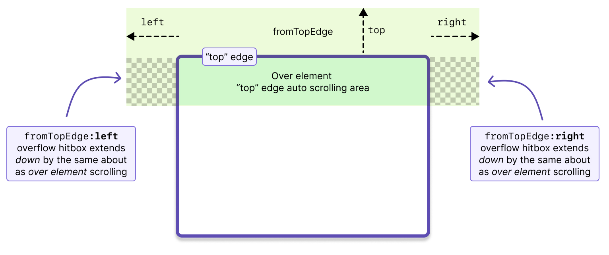
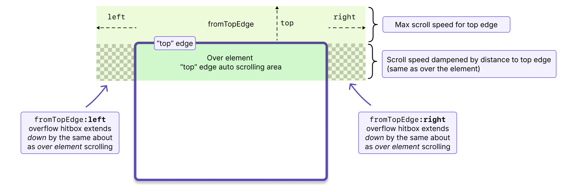

import SectionMessage from '@atlaskit/section-message';
import UnsafeOverflowExample from '../../examples/unsafe-overflow';

Unsafe overflow scrolling allows the user to scroll a scrollable element when they are no longer
over the element.

<Example Component={UnsafeOverflowExample} appearance="showcase-only" />

## Challenges with overflow scrolling

<SectionMessage appearance="warning" title="Avoid overflow scrolling">

These challenges are why overflow scrolling is considered unsafe. It should only be used when there
is a strong product justification.

</SectionMessage>

### It can be confusing for users

Overflow scrolling can feel great, but it does not play well with the web platform's drag and drop
capabilities. In order to update the drop target for a drag operation, the user needs to drag over
an element. With overflow scrolling, the interface can be changing, but the drop target might not be
as the user might not be over the drop target. This can be confusing for users

### It is easy to create strange experiences

When you enable overflow scrolling, it is easy to have multiple scrollable elements scrolling at the
same time in unexpected ways. This is because we can no longer rely on the DOM hierarchy to help us
provide an scrolling experience that will always feel great. This package gives you the control to
setup auto scrolling how you want it, but you will need to be careful to ensure that the settings
you have chosen work well for the experience you are making.

### It is more expensive than standard overflow scrolling

When doing standard 'over element' auto scrolling, we can leverage the DOM hierarchy to quickly
search for relevant scroll containers. We cannot do that for overflow scrolling. For every overflow
scrolling registration (eg `unsafeOverflowForElements()`), we need to do a
`element.getBoundingClientRect()` in each animation frame to see if we are over the element (we have
to re-create hitbox testing). Doing excessive amounts of of `getBoundingClientRect()` can get
expensive, so we suggest you don't add too many overflow scrolling registrations.

## Registering unsafe overflow scrolling for scrollable elements

Registering unsafe overflow scrolling will only enable scrolling when outside of the element. If you
want the element to be scrollable when over the element, then you will also need to add 'over
element' auto scrolling as well (eg `autoScrollForElements()`).

```ts
// each adapter type has its own overflow auto scroller
import { unsafeOverflowForElements } from '@atlaskit/pragmatic-drag-and-drop-auto-scroll/unsafe-overflow/element';
import { unsafeOverflowForExternal } from '@atlaskit/pragmatic-drag-and-drop-auto-scroll/unsafe-overflow/external';
import { unsafeOverflowForTextSelection } from '@atlaskit/pragmatic-drag-and-drop-auto-scroll/unsafe-overflow/text-selection';

import { autoScrollForElements } from '@atlaskit/pragmatic-drag-and-drop-auto-scroll/element';

const cleanup = combine(
	// Enabling scrolling when over an element
	autoScrollForElements({
		element,
	}),
	// Enabling scrolling when outside an element - in the overflow
	unsafeOverflowForElements({
		element,
	}),
);

// disable auto scrolling
cleanup();
```

A slightly fuller example of a `react` list that is a drop target, and has auto scrolling:

```tsx
import { useRef, ReactElement } from 'react';
import { dropTargetForElements } from '@atlaskit/pragmatic-drag-and-drop/element/adapter';
import { autoScrollForElements } from '@atlaskit/pragmatic-drag-and-drop-auto-scroll/element';
import { unsafeOverflowForElements } from '@atlaskit/pragmatic-drag-and-drop-auto-scroll/unsafe-overflow/element';
import { combine } from '@atlaskit/pragmatic-drag-and-drop/combine';
import invariant from 'tiny-invariant';

function ScrollableList({ children }: { children: ReactElement }) {
	const ref = useRef<HTMLDivElement | null>(null);

	useEffect(() => {
		const element = ref.current;
		invariant(element, 'Element ref not set');

		return combine(
			dropTargetForElements({
				element,
			}),
			// Enabling scrolling when "over" an element
			autoScrollForElements({
				element,
			}),
			// Enabling overflow auto scrolling
			unsafeOverflowForElements({
				element,
			}),
		);
	});

	return (
		<div ref={ref} style={{ overflowY: 'scroll' }}>
			{children}
		</div>
	);
}
```

### Element scrolling rules and behaviour

Overflow scrolling has the same flexible rules as 'over element' auto scrolling - you can have any
setup you want, and change anything you want during a drag.

## `unsafeOverflowAutoScrollFor*` arguments

- `element`: the `HTMLElement` you want to add auto scrolling too. The `element` does not need to be
  a `dropTarget`. The `element` is the unique key for an auto scrolling registration.
- `getOverflow: () => ProvidedHitboxSpacing`. `ProvidedHitboxSpacing` allows you to specify how
  overflow scrolling should occur for a element.

`getOverflow()` allows you to specify how overflow scrolling should work for each edge of an
element.



```ts
// Only allow overflow scrolling above and below an element by 400px
unsafeOverflowAutoScrollForElements({
	element,
	getOverflow: () => ({
		forTopEdge: {
			top: 400,
		},
		forBottomEdge: {
			bottom: 400,
		},
	}),
});

unsafeOverflowAutoScrollForElements({
	element,
	getOverflow: () => ({
		forTopEdge: {
			// Allow the top element to be overflow scrolled up to
			// 2000px away from the element
			top: 2000,
			// Allow the top element to be overflow scrolled when
			// up to 200px on the left or right of the top edge.
			// The hitbox for scrolling will extend down below the top edge
			// to match the "over element" hitbox for the top edge.
			// See the diagram for more details.
			left: 200,
			right: 200,

			// The "bottom" edge definition for the "top" edge is
			// handled by the "over element" auto scroller.
		},
	}),
});
```

- _(optional)_: `canScroll: (args: ElementGetFeedbackArgs) => boolean`: whether or not auto
  scrolling should occur. Disabling auto scrolling with `canScroll` will _not_ prevent the browser's
  built in auto scrolling, or manual user scrolling during a drag. Unfortunately, there is no way to
  opt out of the platform's built in auto scrolling. We included `canScroll` because it is helpful
  to disable this package's auto scrolling, as it is much easier for users to trigger than the
  platform's built in auto scrolling.

## Scroll acceleration

- Builds on 'over element' auto scrolling.
- When outside of the element on the main axis of an edge (eg vertical axis for the top edge), then
  the max scroll speed is applied.
- Time dampening timer is shared with 'over element' auto scrolling. This means that time dampening
  will carry over correctly when moving between 'over element' and 'overflow scrolling'.
- Distance dampening is applied when in the "cross axis" component of an edges hitbox (see the
  checkered area of the diagram below). This is so that the scroll speed inside an edge is the same
  when inside the element, or when outside the element.



## Window scrolling

Overflow scrolling is not applicable for window scrolling as the browser stops publishing events to
the document once the user has left the window. If you want to have window scrolling, then use our
standard approach for [registering auto scrolling for the window](../about).
