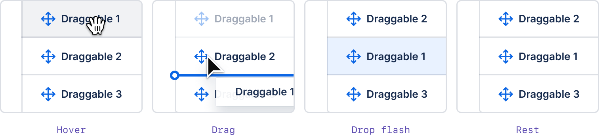
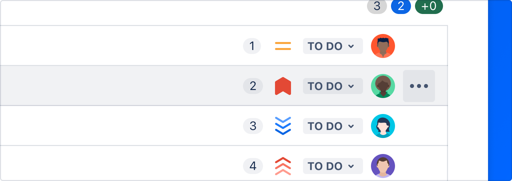
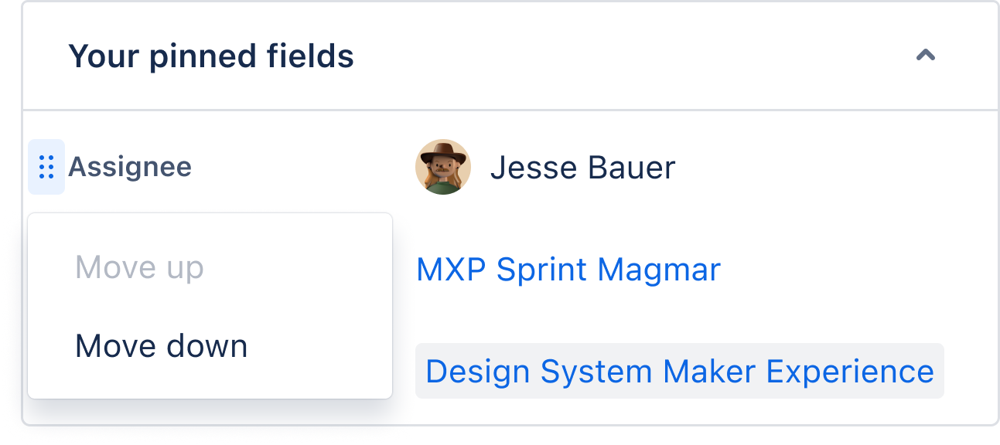

import SectionMessage from '@atlaskit/section-message';
import ListExample from '../../examples/list';
import BoardExample from '../../examples/board';
import TreeExample from '../../examples/tree';
import { EntireEntityIsDraggable } from '../../examples/guidelines/entire-entity-is-draggable';
import { OnlyDraggableFromDragHandle } from '../../examples/guidelines/only-draggable-from-drag-handle';
import { HoverDragHandle } from '../../examples/guidelines/hover-drag-handle';
import { HoverDragHandleOutsideBounds } from '../../examples/guidelines/hover-drag-handle-outside-bounds';
import { AllDragHandleVariants } from '../../examples/guidelines/all-drag-handle-variants';
import { DelayedCursorChange } from '../../examples/guidelines/delayed-cursor-change';
import { ImpliedDraggable } from '../../examples/guidelines/standalone-card';
import { EntireEntityIsDraggableWithDragHandleButton } from '../../examples/guidelines/entire-entity-is-draggable-with-drag-handle-button';

These guidelines provide an opinionated way to implement drag and drop experiences with Pragmatic
drag and drop for Atlassian interfaces. These guidelines work within
[web platform design constraints](/components/pragmatic-drag-and-drop/web-platform-design-constraints)
for drag and drop, and aim to optimise clarity and performance. Non-Atlassian consumers are welcome
to use these guidelines, or create their own visual language for drag and drop. The
[core package](/components/pragmatic-drag-and-drop/core-package) does not have any baked in design
opinions, but some of the [optional packages](/components/pragmatic-drag-and-drop/optional-packages)
embody these design choices.

<SectionMessage appearance="discovery">

These design decisions are available in our
[Pragmatic drag drop Figma UI Kit](<https://www.figma.com/file/3E3rGPX4YHlVUP3cNyRykB/Pragmatic-Drag-%26-Drop-UI-Kit-(PDND)>)
(Atlassian only).

We plan on soon making this Figma public soon.

</SectionMessage>

Cards, lists, and other UI can often be dragged and reordered. Design clear and consistent drag and
drop experiences in Atlassian apps following these principles:

## Before the drag starts

**Make it clear what can be dragged**

When drag and drop is a _primary action_ for an entity, you should:

1. use an always visible drag handle icon (an exception for this is when drag and drop is "implied",
   for example cards on a board)
2. use `:hover { cursor: grab }`
3. Change the background color on item hover

When drag and drop is a _secondary action_ for an entity, you should:

1. use a drag handle icon that is visible on `:hover` or `:focus-within`
2. use `:hover { cursor: grab }` after an `800ms` delay (see below for how to do this with CSS)
3. Change the background color on item hover

An example of drag and drop as a secondary section is a menu items in a side navigation. The primary
action for a menu item would be navigation, and a secondary action would be moving the menu item
through drag and drop.

<SectionMessage>

Please also see our
[accessibility guidelines](/components/pragmatic-drag-and-drop/accessibility-guidelines) which talks
about our guidance for placing an action menu trigger on draggable entities to enable the same
outcomes as drag and drop interactions for assistive technology users.

</SectionMessage>

### Which parts of an entity should be draggable?

As a starting position, if an entity is draggable (eg a card), then make the whole entity draggable.
If the entity has other interactive parts (eg buttons, dropdowns), then just make the drag handle
icon the draggable part of the entity.

Something to keep in mind is that making an entire entity `draggable` will prevent text selection
inside that entity (platform limitation)

### Drag handle icons

Our drag handle icon helps people understand what is draggable. Please use the `"small"`
`DragHandleVerticalIcon` from [@atlaskit/icon](/components/icon).

```tsx
import DragHandleVerticalIcon from '@atlaskit/icon/core/drag-handle-vertical';

function DragHandle() {
	return <DragHandleVerticalIcon size="small" />;
}
```

The color of the icon should match the text color of text in the draggable entity. This is usually
handled for you by default with [@atlaskit/icon](/components/icon) as it uses `currentColor` by
default.

All available variants, which are explained in detail below:

<Example Component={AllDragHandleVariants} appearance="showcase-only" />

#### Always visible drag handle

When dragging is a primary action of an entity, there should be a visible drag handle on the left
hand side of the entity at all times.

<Example Component={EntireEntityIsDraggable} appearance="showcase-only" />

You should also make your drag handle always visible if your drag handle is also your
[action button](/components/pragmatic-drag-and-drop/optional-packages/react-accessibility).

<Example Component={EntireEntityIsDraggableWithDragHandleButton} appearance="showcase-only" />

When the drag handle is the only part of an entity that is draggable, it's touch target size should
be at least `24px x 24px` in size (`"spacious"` icon spacing).

<Example Component={OnlyDraggableFromDragHandle} />

#### Visible on hover drag handle

If dragging is a secondary action for an entity, then you _can_ use a delayed drag handle (it is
only visible on `:hover` and `:focus-within`).

- This approach can be helpful when you don't want add clutter to an interface when drag and drop is
  a secondary action.
- Keep in mind that using this approach will make it harder for users to discover that an entity is
  draggable.
- The drag handle icon should use `"compact"` spacing (`16px x 16px`) so you don't leave a big gap
  in the interface for where the drag handle icon will appear.
- For best performance, use CSS to hide and show the drag handle on `:focus-within` or `:hover`.

```tsx
import DragHandleVerticalIcon from '@atlaskit/icon/core/drag-handle-vertical';

function DragHandle() {
	return <DragHandleVerticalIcon spacing="compact" size="small" />;
}
```

<Example Component={HoverDragHandle} appearance="showcase-only" />

A visible on hover drag handle can appear _outside_ of the bounds of an element if you are pressed
for room. In this scenario it's important that you make sure that a user can start the drag from the
drag handle.

What you need to do:

- Make sure your drag handle is a
  [part of the hitbox of the containing element](https://www.youtube.com/watch?v=zVFJAwrCQCM)
- Make sure your drag handle allows pointer events (`pointer-events: auto`)

<Example Component={HoverDragHandleOutsideBounds} appearance="showcase-only" />

### Implied draggables

Some entities are considered to be "implied" to be draggable (eg cards and columns) and these
entities do not require a drag handle icon - although you can still encouraged to add them. Implied
draggable entities should use background color and cursor changes to make it clear which part of the
entity is draggable, and there should be a strong preference to make as much of the entity draggable
as possible.

<Example Component={ImpliedDraggable} appearance="showcase-only" />

Sometimes, your drag handle icon should be a button for triggering actions too (see our
[accessibility guidelines](/components/pragmatic-drag-and-drop/accessibility-guidelines)). In those
cases, please use our
[drag handle icon button](/components/pragmatic-drag-and-drop/optional-packages/react-accessibility).

<Example Component={EntireEntityIsDraggableWithDragHandleButton} appearance="showcase-only" />

### Cursor changes

Use `:hover { cursor:grab; }` as a helpful signal that an entity is draggable. Only the draggable
part of an entity should have `cursor:grab`. So when a draggable is only draggable from a drag
handle, only the drag handle should have `cursor:grab`.

For entities where dragging is a secondary action (and you are therefore using a "visible on focus
drag handle"), you should also delay the changing of the cursor to `grab` by `800ms`

<Example Component={DelayedCursorChange} appearance="showcase-only" />

[We _strongly_ recommend you implement this behaviour with CSS](https://x.com/alexandereardon/status/1702192381007917452)
(no JS needed!)

```css
@keyframes change-cursor {
	to {
		cursor: grab;
	}
}

.item:hover {
	animation-name: cursor-change;

	/* instant animation */
	animation-duration: 0s;

	/* delay cursor change */
	animation-delay: 800ms;

	/* keep the end state when the animation ends */
	animation-fill-mode: forwards;
}
```

### Background color changes

The draggable part of an entity should have a background color change applied when hovering over it.

Please use the appropriate [hover token](/components/tokens/all-tokens) for the entity.

Usually for a draggable entity you will be using:

- `elevation.surface` as the background color.
- `elevation.surface.hovered` on as the `hover` background color on the draggable part of the
  entity.

<Example Component={AllDragHandleVariants} appearance="showcase-only" />

For some situations it might be appropriate to use a different color pairing. Please try to use a
`".background"` color token for the draggable entity, and a matching `".hovered"` token for the
hover.

## Start of a drag

**Make it clear what is being dragged**

It is important that you give clear feedback to the user about what is being dragged.

### Drag previews

A drag preview is a representation of the item being dragged. Generally a drag preview is a picture
of the item being dragged around the page, and not the draggable item itself.

When an item is small and simple, the drag preview can be an exact copy of the item being dragged.
If an item is larger or more complex, you should simplify the drag preview.

Simplification suggestions:

- Use a maximum of three pieces of information in a preview
- Use a maximum preview size of `280px x 280px` to prevent
  [super low drag preview opacity on Windows](/components/pragmatic-drag-and-drop/web-platform-design-constraints)

#### Standard

Drag previews should generally be pushed away from the users pointer by `space.100` vertically, and
`space.200` horizontally. Do not rotate the drag preview.

```
{
  x: token('space.200', '16px'),
  y: token('space.100', '8px'),
}
```


#### Cards

Cards are to be dragged from the point they're grabbed from (no offset).


Do not rotate card drag previews. _Exception:_ Trello, which has a `4deg` rotation.

### Cursor

Due to
[web platform constraints](/components/pragmatic-drag-and-drop/web-platform-design-constraints), we
have limited control of the cursor during a drag operation. The cursor will generally be
`cursor:default` during a drag operation.

[More information about cursors](/components/pragmatic-drag-and-drop/web-platform-design-constraints#cursors).

### The draggable item

While an item is being dragged, the original item should stay in place and dim to `40%` opacity
(`opacity: 0.4`) while the drag preview is being moved around.


### Multiple-item drag previews

For multi-item drag previews, use a stacked appearance with a badge indicating the number of items
being dragged.

- **Four or more small items** such as list items should appear as a stacked preview under the first
  item. Less than four small items can appear separately where space allows (all items showing in
  the preview).
- **Any more than one large item** (card) should show as a stack with a badge indicating the number
  underneath.


Implement with
[native drag previews](/components/pragmatic-drag-and-drop/core-package/adapters/element/drag-previews),
or use the
[Figma kit (Atlassian only)](<https://www.figma.com/file/3E3rGPX4YHlVUP3cNyRykB/Pragmatic-Drag-%26-Drop-UI-Kit-(PDND)?type=design&node-id=38-5065&mode=design>)
in designs.

## While dragging

**Make it clear what the result will be**

It should be clear to a user what the final result of the drag operation will be during the drag
operation.

There are two signals you can use to indicate drop placement:

1. Drop indicator (a line)
2. Background color (`color.background.selected.hovered`)

### Drop indicator

The drop indicator line is used to communicate relative placement (for example, before or after an
item in a list)


A drop indicator line should have the following properties:

| Property                         | Value                     |
| -------------------------------- | ------------------------- |
| Stroke size                      | `2px`                     |
| Color                            | `"color.border.selected"` |
| Terminal diameter                | `8px` (`"space.100"`)     |
| Border radius on right hand side | none                      |

The terminal should bleed `4px` outwards on the left hand side of the target item. When this
bleeding is not possible due to UI constraints (such as the element appearing in a scroll container
which would cause the terminal to be cut off) then the terminal "bleeding" can be disabled and the
terminal can sit against the left edge of the entity

For stacked items, the line should appear in the middle of the gap between the items.

- [Edge detection package](/components/pragmatic-drag-and-drop/optional-packages/hitbox): determines
  when and where the drop indicator shows based on the location of the dragged item.
- [React drop indicator package](/components/pragmatic-drag-and-drop/optional-packages/react-drop-indicator):
  draw drop indicators

<Example Component={ListExample} appearance="showcase-only" />

A drop indicator line should _not_ be used when a draggable item is being dragged over a droppable
area where there is no relative placement possible (for example, dropping into an empty sibling
list).


### Background color

A background color change is used to communicate that an item will be placed within a particular
droppable area. Background color changes should be used when there are multiple possible areas of
the page a draggable item can be dropped on. The droppable area that the user is currently over
should have its background color changed. A background color change should also occur when a
draggable item starts in a droppable area, when there are multiple possible droppable areas.


A background color change to communicate that dropping is possible should only be applied when a
user can perform a drop operation. Sometimes an entity (eg a column) only allows dropping on a
subset of that entity. Only the subset that allows dropping should have a background color change,
and only when the user is dragging over that subset. We don't want to have a situation where a
background color changes, but when the user drops, nothing happens.

Background color change animation details:

| Property         | Value                                                                              |
| ---------------- | ---------------------------------------------------------------------------------- |
| Background color | `"color.background.selected.hovered"`                                              |
| Easing           | `cubic-bezier(0.15, 1.0, 0.3, 1.0)` (`import {easeInOut} from '@atlaskit/motion'`) |
| Duration         | `350ms` (`import {mediumDurationMs} from '@atlaskit/motion'`)                      |

When draggable items can only be moved relatively within a single container, then no background
color change should be used when the user is dragging something within the experience.


### Nested structures

When there are multiple horizontal levels available as drop targets (for example, trees), then we
encourage the use of extra visual affordances to make the levelling clearer:

1. Change the background color to `'color.background.information'` for all items on the level
2. Add an outline to the level with the following properties:

```tsx
const styles = css({
	backgroundColor: token('color.background.information'),
	borderRadius: token('radius.xsmall'),
	outlineOffset: token('space.075'),
	outlineWidth: token('border.width.outline'),
	outlineStyle: 'solid',
	outlineColor: token('color.border.selected'),
});
```

<Example Component={TreeExample} appearance="showcase-only" />

## On drop

When the drag operation finishes, we want to:

1. Allow users to quickly perform other operations
2. Make it clear what the user achieved

### Optimistically update the UI

After a drag operation completes, you should immediately update the interface to reflect the outcome
of the drag operation. This is known an as "optimistic update" as the interface is updated _before_
the change has been persisted on your backend. In addition to your optimistic update, you should
fire off an asynchronous request to persist the outcome of the drag operation.

<SectionMessage>

Optimistic updates _might_ not be available for every possible interaction, but it should be an
_extremely_ strong preference to provide optimistic updates.

</SectionMessage>

### Flash the moved item

To improve clarity about what the user achieved, the background color of the moved item should flash
once it has been moved.

.

We have implemented this flash in our
[flourish package](/components/pragmatic-drag-and-drop/optional-packages/flourish) for you to use
with any framework.

Background color flash details:

| Property         | Value                                                                      |
| ---------------- | -------------------------------------------------------------------------- |
| Background color | `"color.background.selected"`                                              |
| Easing           | `cubic-bezier(0.25, 0.1, 0.25, 1.0)` (not available in `@atlaskit/motion`) |
| Duration         | `700ms` (`import {largeDurationMs} from '@atlaskit/motion'`)               |

## Provide accessible controls

All draggable items should also have the ability to achieve the same outcomes using assistive
technology friendly controls.

<SectionMessage>

See our [accessibility guidelines](/components/pragmatic-drag-and-drop/accessibility-guidelines)

</SectionMessage>

### Prefer visible drag handle icons

Please make drag handle icons visible (where possible) as this is a helpful signal for people that
an item is draggable.

### Action menus for move actions

If the item already has a more actions (…) menu, put the move actions inside of the menu. This
provides a keyboard accessible way to move items that doesn’t rely on mouse clicking and dragging.



### Drag handle icon menus for move actions

If the entity does not have any more actions (…), make the drag handle icon into a menu button. When
triggered, the drag handle button opens a menu that allows the users to move the item.



Use the
[drag handle menu component](/components/pragmatic-drag-and-drop/optional-packages/react-accessibility)
in code or the
[Figma kit drag handle menu (Atlassian only)](<https://www.figma.com/file/3E3rGPX4YHlVUP3cNyRykB/Pragmatic-Drag-%26-Drop-UI-Kit-(PDND)?type=design&node-id=38-2098&mode=design>)
in designs.

## Experience specific guidance

These are guidelines that are in addition to our standard guidance for specific experiences

### Trees

<Example Component={TreeExample} appearance="showcase-only" />

<SectionMessage appearance="discovery">

For tree items, you should use our
[list item hitbox](/components/pragmatic-drag-and-drop/optional-packages/hitbox/about) and our
[list item react drop indicator](/components/pragmatic-drag-and-drop/optional-packages/react-drop-indicator/)
(if your experience uses react).

</SectionMessage>

<SectionMessage appearance="discovery">

If you are wiring up drag and drop for our `navigation-system` side navigation,
[we have specific guidance for you](/components/navigation-system/side-nav-items/drag-and-drop)

</SectionMessage>

#### Drag starting

- If dragging a tree item that has children in it, you should collapse the tree item when the drag
  starts. [A video explaining the rationale for this](https://www.youtube.com/watch?v=Dht2dqrSEkE)
- If your tree uses a pattern where tree items that have icons are replaced by chevrons on hover,
  when the drag starts change all the tree item icons to be chevrons. This will help make it clearer
  to users which part of the interface are potentially expandable.

#### While dragging

- Tree items can be drop targets and can support up to three operations: `"reorder-before"`,
  `"reorder-after"` and `"combine"` (see
  [list item hitbox](/components/pragmatic-drag-and-drop/optional-packages/hitbox/about) for more
  details).
- The size of the operation hitboxes are controlled by the
  [list item hitbox](/components/pragmatic-drag-and-drop/optional-packages/hitbox/about).
- Use the
  [list item react drop indicator](/components/pragmatic-drag-and-drop/optional-packages/react-drop-indicator)
  to visualize the
  [list item hitbox operation](/components/pragmatic-drag-and-drop/optional-packages/hitbox/about)
  (eg `"combine"`) that would be achieved if the user dropped the item. This will be a line above
  the target tree item for `"reorder-above"`, a line below the target tree item for
  `"reorder-below"` and a border around the target tree item for `"combine"`.
- If a user drags over a collapsed tree item with the `"combine"` operation for `500ms`, then the
  collapsed tree item should expand (and should stay expanded even after the drag finishes)
- Use our
  [group drop indicator](/components/pragmatic-drag-and-drop/optional-packages/react-drop-indicator)
  around the innermost group of tree items being dragged over (see tree example for illustration)

#### On drop

- If the tree item being dragged was expanded when the drag started, re-expand the item. If the tree
  item was collapsed when the drag started, keep it collapsed.
- The dragged tree item must be visible after the drag has finished. This can involve expanding any
  parent tree items needed. For example: dragging `item A` onto `item B` with a `"combine"`
  operation can make `item A` a child of `item B`. If `item B` was not expanded at the end of the
  drag (ie it was not dragged over for `500ms` with the `"combine"` operation), then `item B` should
  be expanded so that `item A` is visible at the conclusion of the drag.

#### Accessible actions

- Tree items should have a standard '...' more menu to trigger movement outcomes
- For list items you generally have predefined movement actions in a dropdown menu (eg
  `"reorder above"`, `"reorder below"` etc). However, for tree items, you add a `"move"` item to the
  more menu dropdown, and that `"move"` item should trigger a Modal. The Modal should contain a form
  which enables all possible movement outcomes for a tree item.

<SectionMessage>

There may be some experiences where exceptions to these recommendations are are warranted, and for
those you should refer to our
[accessibility guidelines](/components/pragmatic-drag-and-drop/accessibility-guidelines#complex-cases)
for general principles and practices.

</SectionMessage>

### Dragging multiple items

How to show when more than one element is selected to be dragged.

<SectionMessage appearance="warning">This design pattern is under construction</SectionMessage>

<details>
  <summary>Work in progress guidance</summary>

#### Cards and boards

Use `color.background.selected` and `color.border.selected` to show the elements that have been
selected, then change to the typical background color at 40% opacity once dragging begins. This
shows where the objects are currently, and where they'll return if no drag location is chosen.

Because cards are larger, multiple cards should be stacked under the first card in the preview. Use
a badge to show how many items are being moved.


Checkboxes are highly recommended to show when one or more items are selected.

<!-- TODO Fix example to match ideal design guide -->
<!-- TODO uncomment this once example is done:
Try selecting and dragging multiple cards in the board below for an example. -->

<!-- <Example Component={BoardExample} appearance="showcase-only" /> -->

#### List items

Use the selected background color token to indicate which items have been selected. Use drag
previews as usual, with all items being dragged in a column in the order they’d appear when dropped.


For more than three or four items, show a badge indicating the number and an implied stack beneath
the top item.

<!-- TODO: Fix example to match ideal design guide -->
<!-- <Example Component={ListExample} appearance="showcase-only" /> -->

</details>

## Related

- [Figma kit (Atlassian only)](<https://www.figma.com/file/3E3rGPX4YHlVUP3cNyRykB/Pragmatic-Drag-%26-Drop-UI-Kit-(PDND)>)
- [Accessibility guidelines](/components/pragmatic-drag-and-drop/accessibility-guidelines)
- [More examples](/components/pragmatic-drag-and-drop/examples)
