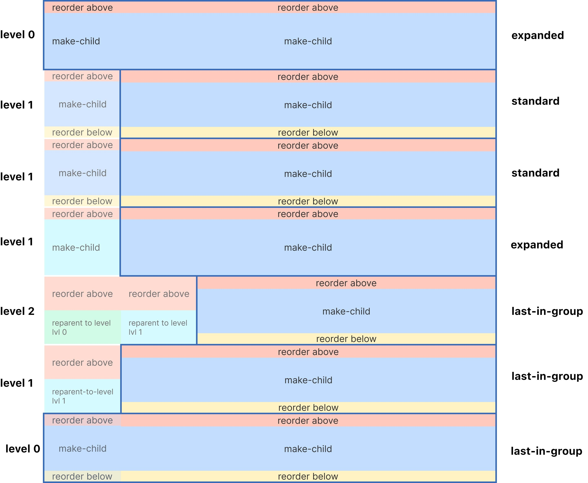

import SectionMessage from '@atlaskit/section-message';

<SectionMessage>

This package depends on [the core package](/components/pragmatic-drag-and-drop/core-package).

This package has no dependency on any view library (eg `react`), or on the Atlassian Design System.

</SectionMessage>

- **[List item](#list-item):** Determines that operation (`"reorder-above"`, `"combine"` or
  `"reorder-below"`) that should be applied to a vertical or horizontal list item (including trees)
- **[Closest edge](#closest-edge):** Detects the closest edge (`"top", "right", "bottom", "left"`)
  for a drop target being dragged over.
- **[Tree item](#tree-item):** (Please now use [list item](#list-item)) Determines the operation
  (`"reorder-above", "reorder-below", "make-child", "reparent"`) to be performed when when a tree
  item is dropped.

## List item

The list item hitbox has been designed to provide rich hitbox information for experiences where
items are ordered after each other. The list item hitbox can also be used in nested structures such
as trees (you can think of each level of a tree as a separate list).

The list item hitbox allows an item to support _up to_ three separate outcomes:

- `"reorder-before"`
- `"reorder-after"`
- `"combine"`

Each operation has three possible values:

- `"not-available"` (default)
- `"available"`
- `"blocked"` (similar to `"available"`, but generally used to show warning colors)

```ts
type Operation = 'reorder-before' | 'reorder-after' | 'combine';

// an `Instruction` contains the applied operation, and whether the operation was blocked.
type Instruction = {
	// What the operation is
	operation: Operation;

	// whether or not the operation was "blocked"
	blocked: boolean;
};
```

```ts
import {
	attachInstruction,
	extractInstruction,
	type Instruction,
} from '@atlaskit/pragmatic-drag-and-drop-hitbox/list-item';

dropTargetForElements({
	element: myElement,
	getData: ({ input, element }) => {
		// your base data you want to attach to the drop target
		const data = {
			itemId: 'A',
		};
		// this will 'attach' the closest edge to your `data` object
		return attachInstruction(data, {
			input,
			element,
			operations: {
				'reorder-before': 'available',
				'reorder-after': 'available',
				combine: 'available',
			},
		});
	},
	onDrop: (args) => {
		const instruction: Instruction | null = extractInstruction(args.self.data);
	},
});
```

### Behaviour

The hitbox for an item will automatically adjust based on which items are `available` or `blocked`:

**All operations are available**

- before start edge: `"reorder-before"`
- first 1/4: `"reorder-before"`
- middle 1/2: `"combine"`
- last 1/4: `"reorder-after"`
- after end edge: `"reorder-after"`

**Only `"reorder-before"` and `"reorder-after"` are available:**

- before start edge: `"reorder-before"`
- first 1/2 `"reorder-before"`
- last 1/2: `"reorder-after"`
- after end edge: `"reorder-after"`

**Only `"reorder-before"` and `"combine"` are available:**

- before start edge: `"reorder-before"`
- first 1/4: `"reorder-before"`
- middle 3/4: `"combine"`
- after end edge: `"combine"`

**Only `"reorder-after"` and `"combine"` are available:**

- before start edge: `"combine"`
- first 3/4: `"combine"`
- last 1/4: `"reorder-after"`
- after end edge: `"combine"`

**Only one operation is available (eg `"combine"`):**

- before start edge: `"combine"`
- in item: `"combine"`
- after end edge: `"combine"`

**No available (or blocked) operations:**

- before start edge: `Instruction` will be `null`
- in item: `Instruction` will be `null`
- after end edge: `Instruction` will be `null`

### Preventing operations

If you don't want a particular operation to be available, you can the operation to
`"not-available"`, or just leave it blank (the default value is `"not-available"`). The hitbox will
automatically adjust to account for which operations are available.

```ts
return attachInstruction(data, {
	input,
	element,
	operations: {
		'reorder-before': 'available',
		'reorder-after': 'not-available', // reordering after no longer available
	},
});
```

### Blocking operations

Sometimes you want to explicitly call out that an operation is not permitted _right now_. An example
of this is draft pages in Confluence which cannot be the target of a drag operation, but once page
is no longer a draft it could be the target of a drag operation. In these cases, it can be helpful
to make it explicit to the user that a particular drag operation can not permitted. You can use
`blocked` for this use case. When an operation is blocked, it will be used by our _drop indicator_
to show a drop indicator with a warning color.

```ts
return attachInstruction(data, {
	input,
	element,
	operations: {
		combine: 'blocked',
	},
});
```

### Vertical and horizontal support

You can use the list item hitbox for vertical or horizontal lists. You need to provide which axis
the interface is on to `attachInstruction`. The `axis` value can be `"vertical"` (default) or
`"horizontal"`.

```ts
return attachInstruction(data, {
	input,
	element,
	axis: 'horizontal', // "vertical" is the default
	operations: {
		'reorder-before': 'available',
		'reorder-after': 'available',
	},
});
```

### Trees

The list item hitbox has been designed to work well with tree structures,
[as you can see in our tree example](/components/pragmatic-drag-and-drop/examples#tree).

Some high level notes when building trees:

- You can treat each level of the tree as a separate "list"
- You can enable whatever operations you like
- For expanded tree items, do not allow `"reorder-after"` operations

### Utilities

There are no utilities specific for our list item hitbox, as it can contain non-reordering
operations (eg `"combine"`) which require more decisions to be made regarding what the state update
could look like. For `"reorder-before"` and `"reorder-after"` operations, you can use our general
purpose [`reorder` utility](/components/pragmatic-drag-and-drop/core-package/utilities#reorder).

## Closest edge

The closest edge addon is used to know what the closest edge is when dragging over a drop target.
Knowing the closest edge can be helpful when doing reordering and moving operations. This addon
leverages the fact that `getData()` is repeatedly called throughout a drag and drop operation.

The `attachClosestEdge()` function adds a unique `Symbol` to your drop target's `data` object, which
allows for type safe lookups with `extractClosestEdge()`.

```ts
type Edge = 'top' | 'right' | 'bottom' | 'left';
```

```ts
import {
	attachClosestEdge,
	extractClosestEdge,
	Edge,
} from '@atlaskit/pragmatic-drag-and-drop-hitbox/closest-edge';

dropTargetForElements({
	element: myElement,
	getData: ({ input, element }) => {
		// your base data you want to attach to the drop target
		const data = {
			itemId: 'A',
		};
		// this will 'attach' the closest edge to your `data` object
		return attachClosestEdge(data, {
			input,
			element,
			// you can specify what edges you want to allow the user to be closest to
			allowedEdges: ['top', 'bottom'],
		});
	},
	onDrop: (args) => {
		const closestEdgeOfTarget: Edge | null = extractClosestEdge(args.self.data);
	},
});
```

### Utilities

Utilities specifically to make working with edges easier.

#### `getReorderDestinationIndex`

When you are rendering _drop indicators_ (eg lines) between items in a list, it can be difficult to
know what the `index` the dropped item should go into. The final `index` will depend on what the
closest `Edge` is. `getReorderDestinationIndex` can give you the final `index` for a reordering
operation, taking into account which `Edge` is closest

```ts
import { getReorderDestinationIndex } from '@atlaskit/pragmatic-drag-and-drop-hitbox/util/get-reorder-destination-index';

// Dragging A on the left of B
// A should stay in the same spot
expect(
	getReorderDestinationIndex({
		// list: ['A', 'B', 'C'],
		// move A to left of B
		startIndex: 0,
		indexOfTarget: 1,
		closestEdgeOfTarget: 'left',
		axis: 'horizontal',
	}),
	// results in no change: ['A', 'B', 'C']
).toEqual(0);

// Dragging A on the right of B
// A should go after B
expect(
	getReorderDestinationIndex({
		// list: ['A', 'B', 'C'],
		// move A to right of B
		startIndex: 0,
		indexOfTarget: 1,
		closestEdgeOfTarget: 'right',
		axis: 'horizontal',
	}),
	// A moved forward ['B', 'A', 'C']
).toEqual(1);
```

#### `reorderWithEdge`

Performs an array reorder operation that takes into account the closest `Edge`. `reorderWithEdge`
uses `getReorderDestinationIndex` internally as well as `reorder` to reorder the array
(`@atlaskit/pragmatic-drag-and-drop/reorder`)

```ts
import { reorderWithEdge } from '@atlaskit/pragmatic-drag-and-drop-hitbox/util/reorder-with-edge';

// Dragging A on the left of B
// A should stay in the same spot
expect(
	reorderWithEdge({
		list: ['A', 'B', 'C'],
		// move A to left of B
		startIndex: 0,
		indexOfTarget: 1,
		closestEdgeOfTarget: 'left',
		axis: 'horizontal',
	}),
	// results in no change
).toEqual(['A', 'B', 'C']);

// Dragging A on the right of B
// A should go after B
expect(
	reorderWithEdge({
		list: ['A', 'B', 'C'],
		startIndex: 0,
		indexOfTarget: 1,
		closestEdgeOfTarget: 'right',
		axis: 'horizontal',
	}),
).toEqual(['B', 'A', 'C']);
```

## Tree item

<SectionMessage appearance="warning">

Please use our new [list-item](#list-item) hitbox, which is a more flexible version of `tree-item`,
and can be used in tree structures.

</SectionMessage>

The tree item addon is used to know what operation should be performed when a tree item is dropped.
The possible drag operations are:

- **reorder-above**: the draggable item should be moved above the item it's dropped on.
- **reorder-below**: the draggable item should be moved below the item it's dropped on.
- **make-child**: the draggable item should be made a child of the item it's dropped on.
- **reparent**: the level of the draggable item should change to a parent of the item it's dropped
  on.

Any drag operation can also be blocked.

Along with the drag position, the current level and the mode of the tree item being dragged over are
used to determine the drag operation that should be performed. Below is a visual example of a tree
hitbox demonstrating this:



The `attachInstruction()` function adds a unique `Symbol` to your drop target's `data` object, which
allows for type safe lookups with `extractInstruction()`. This addon leverages the fact that
`getData()` is repeatedly called throughout a drag and drop operation.

```ts
type ItemMode = 'standard' | 'expanded' | 'last-in-group';
```

```ts
type Instruction =
	| {
			type: 'reorder-above';
			currentLevel: number;
			indentPerLevel: number;
	  }
	| {
			type: 'reorder-below';
			currentLevel: number;
			indentPerLevel: number;
	  }
	| {
			type: 'make-child';
			currentLevel: number;
			indentPerLevel: number;
	  }
	| {
			type: 'reparent';
			currentLevel: number;
			indentPerLevel: number;
			desiredLevel: number;
	  }
	| {
			type: 'instruction-blocked';
			desired: Exclude<Instruction, { type: 'instruction-blocked' }>;
	  };
```

```ts
import {
	attachInstruction,
	extractInstruction,
	Instruction,
} from '@atlaskit/pragmatic-drag-and-drop-hitbox/tree-item';

dropTargetForElements({
	element: myElement,
	getData: ({ input, element }) => {
		// your base data you want to attach to the drop target
		const data = {
			itemId: 'A',
		};
		// this will 'attach' the instruction to your `data` object
		return attachInstruction(data, {
			input,
			element,
			currentLevel: 2,
			indentPerLevel: 20,
			mode: 'standard',
			// you can specify instructions to block
			block: ['reorder-below'],
		});
	},
	onDrag: (args) => {
		const instruction: Instruction | null = extractInstruction(args.self.data);
	},
});
```
